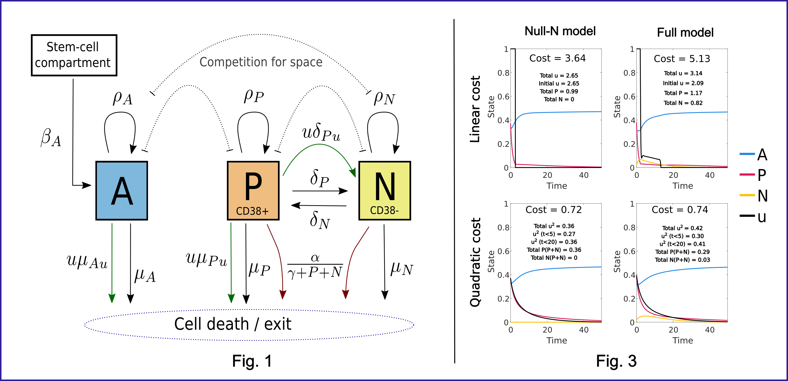

# Optimal control of Multiple Myeloma treatment

MATLAB code formulating and numerically solving an optimal-control problem for a dynamical-systems model of cancer treatment.

This code was developed for the paper "Optimal control of Multiple Myeloma assuming drug resistance and off-target effects" [Lefevre et al. (2025), *PLOS Computational Biology* 21. DOI: 10.1371/journal.pcbi.1012225]([https://journals.biologists.com/dev/article-abstract/144/6/1087/48348](https://journals.plos.org/ploscompbiol/article?id=10.1371/journal.pcbi.1012225)). It implements simulation (numerical solution of a boundary value problem) and optimal-control calculation for a model of Multiple Myeloma treatment with the drug Daratumumab ("DARA"), featuring drug resistance and off-target effects. Three cost functions are implemented: a linear function, a quadratic function, and a weighted average of both.

 
*Figures 1 and 3 of [Lefevre et al. (2025)]([https://journals.biologists.com/dev/article-abstract/144/6/1087/48348](https://journals.plos.org/ploscompbiol/article?id=10.1371/journal.pcbi.1012225)), showing the model outline and sample optimal control results. Cancer cells can resist the drug effect by suppressing expression of the CD38 receptor (population $N$), but at the cost of lower fitness than the CD38+ population ($P$). The combined $P+N$ cancer cell population competes for space with the healthy population $A$. The control $u$ is the drug (Dara) dose over time that has been optimised to minimise a cost function integrated over time.*

## What it does

- **Simulation** — numerical solution of the model (a boundary value problem).
- **Optimal control** — computing the optimal treatment control under three cost functions (linear, quadratic, and a weighted average of the two), using .
- **Steady-state analysis** — model equilibria and optimal steady-state treatment.

## Running it

The code is set up to run ad-hoc experiments. Examples can be executed by opening `optimal_control_examples.m`, `simulation_examples.m` or `other_calculations_examples.m` and running selected code blocks. These examples can be adapted and executed in a script. Primary outputs are figures, which are saved in png or svg format, or in the Matlab fig format which contains embedded data that can support further quantitative analysis.

## Built with

MATLAB R2021b. No additional toolboxes required.

## License

Released under the MIT License — see [LICENSE.md](LICENSE.md).
